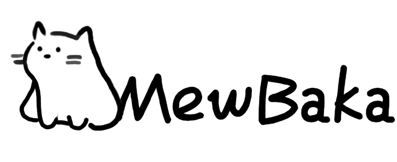

# OtherSideProject-Electron

该项目是[OtherSideProject](https://github.com/MewBaka/OtherSideProject) Electron版本项目，使用Electron框架开发。  

该仓库专注于Electron版本的开发，如果对主项目存在疑问，请前往对应仓库开启Issue

> 本仓库已经和主仓库合并，并且今后所有的更新都会在主仓库上发布

## 欢迎来到我们的爱发电

https://afdian.com/a/OtherSideProject

我们已入驻爱发电，部分开发日志将会发布于此，您也可以自由捐赠，助力更好的侧面

## 平台考虑

- Windows 10: 计划兼容
- Windows 11: 计划兼容
- MacOS: 可能兼容
- Ubuntu: 计划兼容
- Debian: 计划兼容
- 其他Linux发行版: 等待测试

## 技术栈

> [Nextron](https://github.com/saltyshiomix/nextron)
> > [Electron](https://www.electronjs.org/)  
> 
> > [Next.js](https://nextjs.org/)  
> > > [React](https://reactjs.org/)  
> > > [TypeScript](https://www.typescriptlang.org/)  

## 贡献

**Origin story by** Wangzixu_旭

**程序设计：** Nomen， 0x24a | **程序UI设计：** WangZixu_旭

**LOGO原稿设计：** 墨泽影 | **设定，脚本编写：** WangZixu_旭，瓦西里.舒克申_Official，神郭嘉，程方宇 Cecffrvy，Bika

**MewBakaLOGO原稿设计：** 南介私雨，WangZixu_旭 | **特别感谢：** 糖屑

## 主项目：OtherSideProject

主仓库：[OtherSideProject](https://github.com/MewBaka/OtherSideProject)

点击链接前往：https://github.com/MewBaka/OtherSideProject

